# memori ✂️
The Hobonichi Techo is a "<a href="https://www.1101.com/store/techo/en/about/">Life Book</a>" with one page for each day of the year. I use mine as a daily planner, journal, and sketchbook.

This year, Hobonichi announced an official <a href="https://techoapp.1101.com/en/">Hobonichi Techo App</a>, which, among other features, lets users print photos that are perfectly sized to fit the Techo's grid paper.

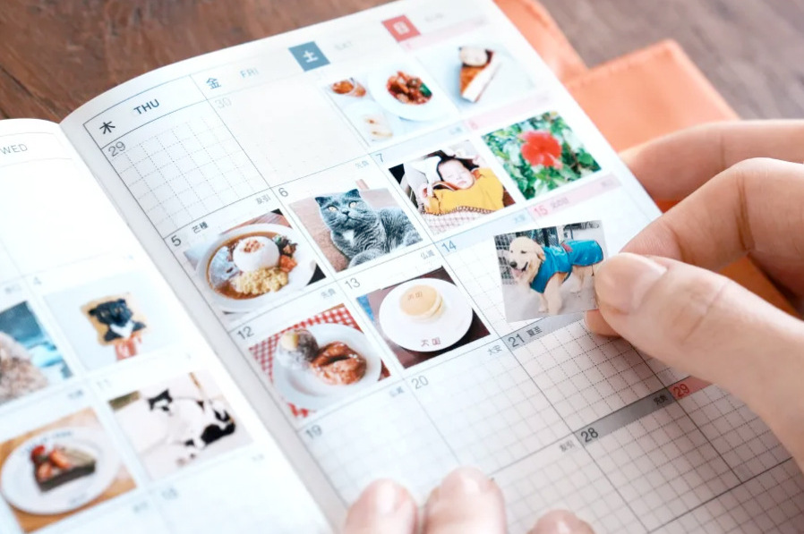<br>

Two tiny problems with this:
<ol>
	<li>
		The app is Japan-exclusive until December 2025
	</li>
	<li>
		The Memory Print feature requires a <a href="https://techoapp.1101.com/en/premium/">paid subscription</a>:
	</li>
</ol>

<a href="https://techoapp.1101.com/en/premium/"></a>

So here's a web app that does the same thing (and then some) for free.

## usage


Different Techo types use differently-spaced grid paper. Use the links below to select the appropriate spacing for your Techo.

| <b>Techo</b> | <b>Link</b> |
|-------------------|-------------|
| Planner A6 | [Use 4mm grid ↗](link)<br>(default) |
| Original<br>Cousin<br>HON A6<br>HON A5<br>Original Avec<br>Cousin Avec<br>5-Year Techo A6<br>5-Year Techo A5<br>Day-Free A6<br>Day-Free A5 | [Use 3.7mm grid ↗](link) |
| Weeks<br>Weeks Mega | [Use 3.55mm grid ↗](link) |

After opening memori in your web browser, drag one or more images from your desktop onto the grid.


- click and drag images to move them<br>
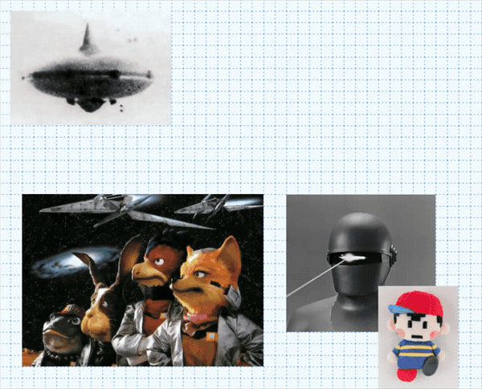

- resize images using the edge/corner resize handles<br>
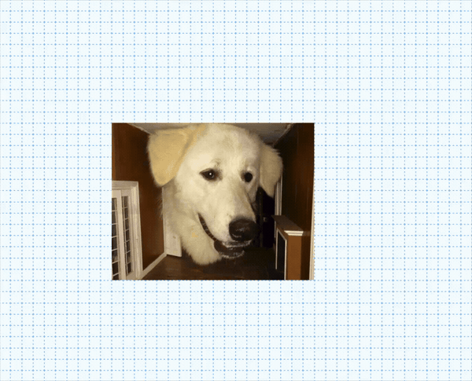

- hover an image and pinch to scale (on supported trackpads)<br>
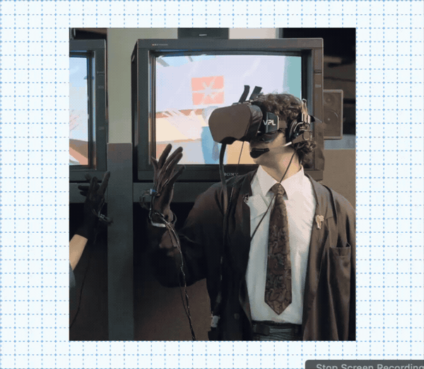
	- or, when using a mouse, scale with `ctrl + scroll`

- hover an image and drag with two fingers to pan (set the "crop" - the part of the image that's visible)<br>

	- when using a mouse, hover an image and `scroll` to pan vertically, or use `shift + scroll` to pan horizontally

- ```⌘ + click``` an image to duplicate it<br>
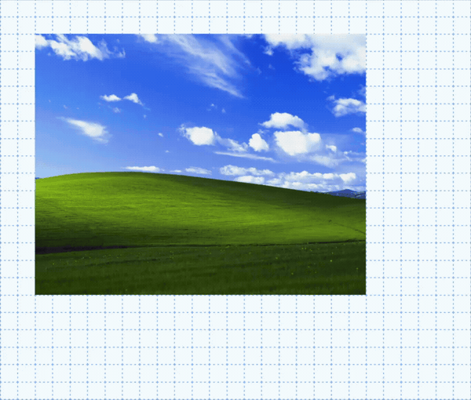

- ```option + click``` an image to rotate it<br>
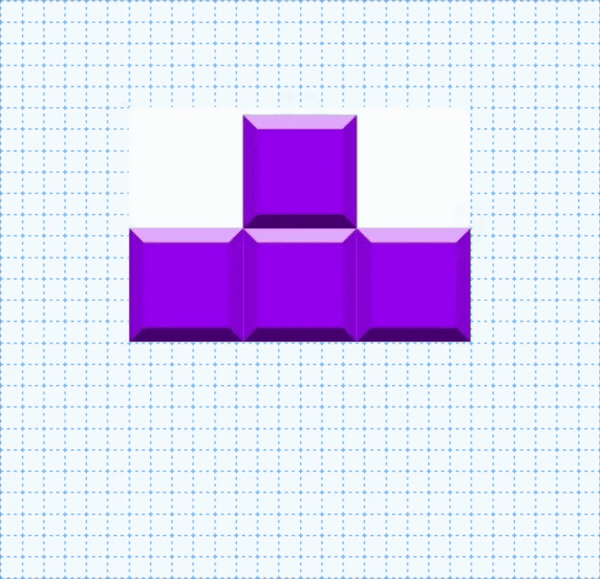

- ```shift + click``` an image to delete it<br>
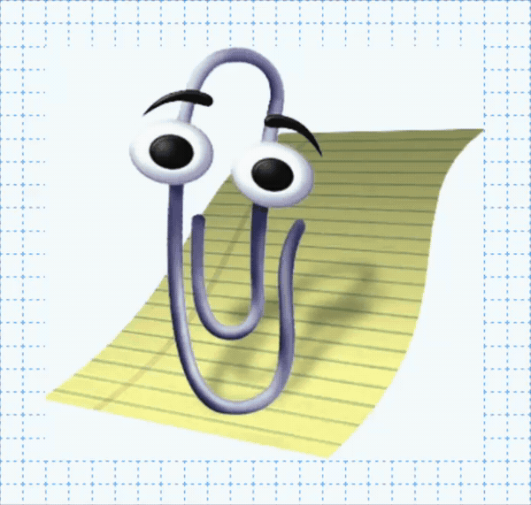

- press ```F2``` to select from one of six user interface themes<br>
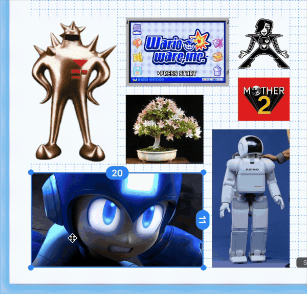

Once you've filled out the page, press ```⌘ + P``` to print using your system's default print dialog:
<br>


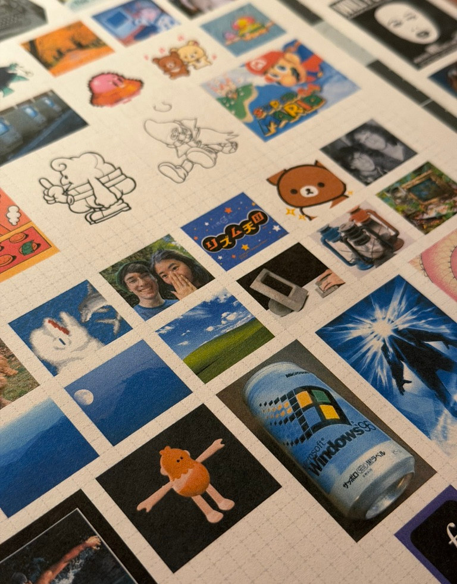

>[!TIP]
>For best results...
>- select "Scale: 100%" rather than "Fit to page width"
>- set Margins to None or 0

Use a hobby knife and a straightedge (or regular old scissors) to cut your images to size:

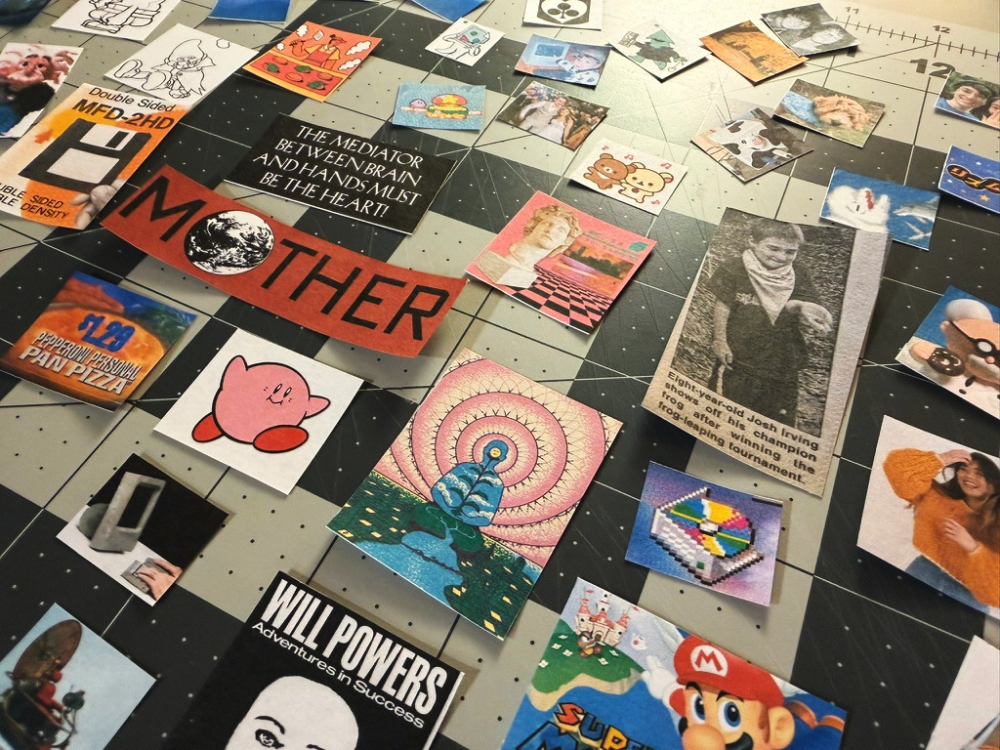

Then stick 'em down with a gluestick (or try printing with sticker paper):

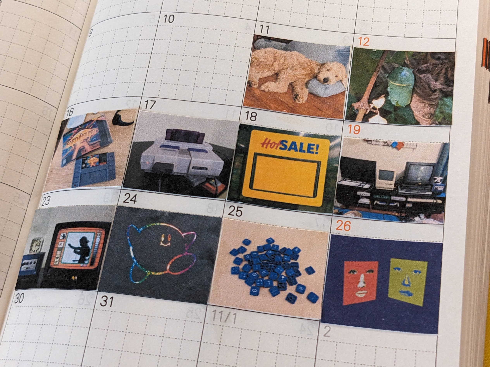
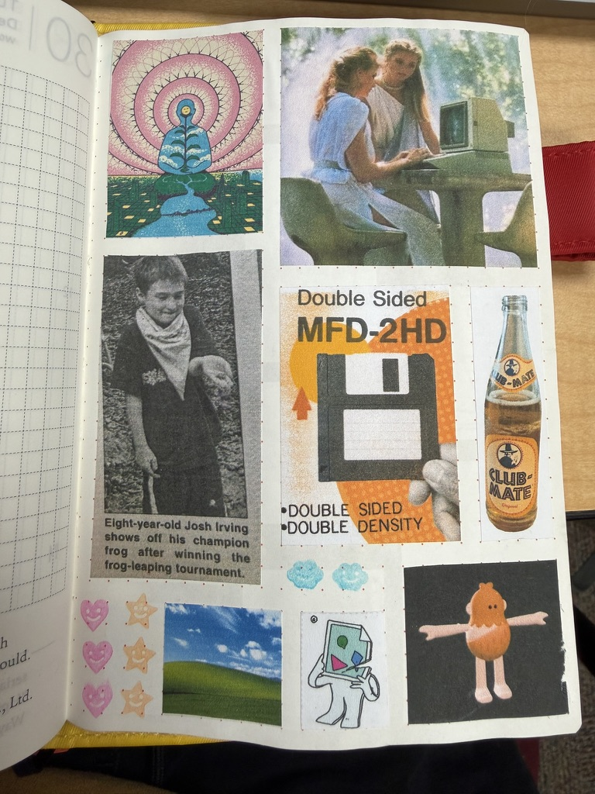

## disclaimer
This project is not affiliated with, endorsed by, or sponsored by Hobonichi Co., Ltd. or any of its subsidiaries. Hobonichi, Hobonichi Techo, and related trademarks are the property of their respective owners. This is an independent, unofficial tool created for personal use.

## license
<a href="LICENSE">GNU GPLv3</a>