# memori ✂️

A free photo-printing tool that perfectly sizes images to fit the <a href="https://www.1101.com/store/techo/en/about/">Hobonichi Techo</a>'s grid paper.

## usage
Different Techo types use differently-sized grid paper. Use the links below to select the appropriate grid size for your Techo:

| <b>Techo</b> | <b>Link</b> |
|-------------------|-------------|
| Planner A6 | [Use 4mm grid ↗](https://hunterirving.github.io/memori?grid-size=4mm)<br>(default) |
| Original<br>Cousin<br>HON A6<br>HON A5<br>Original Avec<br>Cousin Avec<br>5-Year Techo A6<br>5-Year Techo A5<br>Day-Free A6<br>Day-Free A5 | [Use 3.7mm grid ↗](https://hunterirving.github.io/memori?grid-size=3.7mm) |
| Weeks<br>Weeks Mega | [Use 3.55mm grid ↗](https://hunterirving.github.io/memori?grid-size=3.55mm) |
| Other planners | Add a "grid-size" parameter to the url like so:<br><a href="https://hunterirving.github.io/memori/?grid-size=5mm">https://<area>hunterirving.github.io/memori/<b>?grid-size=5mm</b></a><br>This value can be anywhere between 2mm and 10mm. |

### controls

- after opening memori in your web browser, drag one or more images from your desktop onto the grid (or press `⌘ + v` to paste image data from your clipboard)<br>
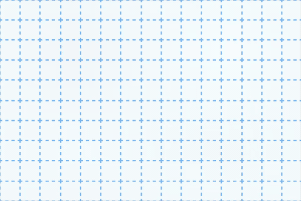

- click and drag images to move them<br>
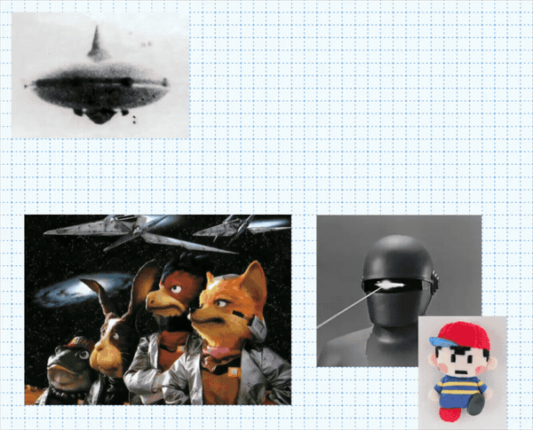

- resize images using the edge/corner resize handles<br>
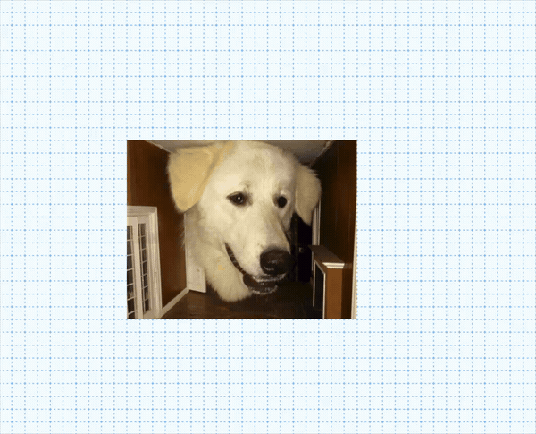

- hover an image and pinch with two fingers to scale (on supported trackpads)<br>
	- or, when using a mouse, scale with `ctrl + scrollwheel`<br>
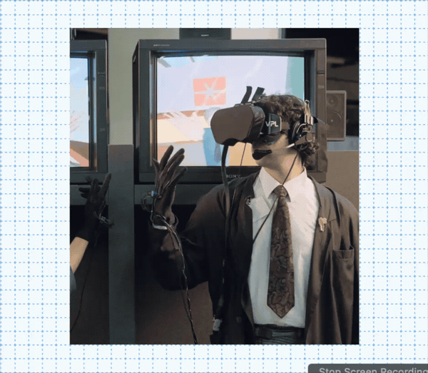

- hover an image and drag with two fingers to pan (set the "crop" - the part of the image that's visible)<br>
	- or, when using a mouse, hover an image and use the `scrollwheel` to pan vertically, or use `shift + scrollwheel` to pan horizontally<br>
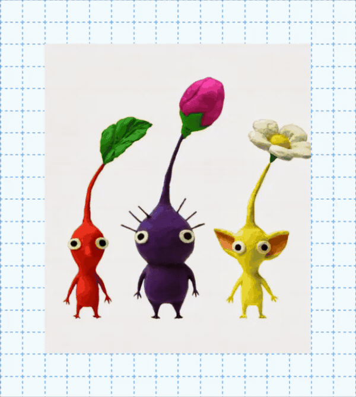

- ```⌘ + click``` an image to duplicate it<br>
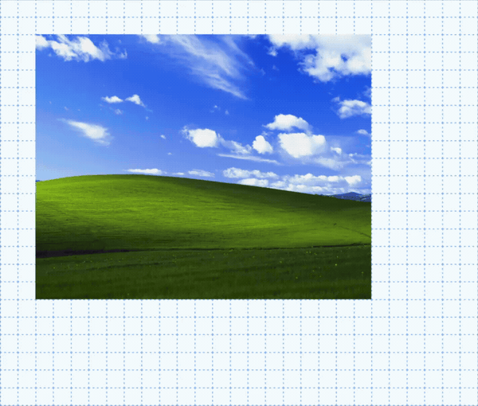

- ```option + click``` an image to rotate it<br>
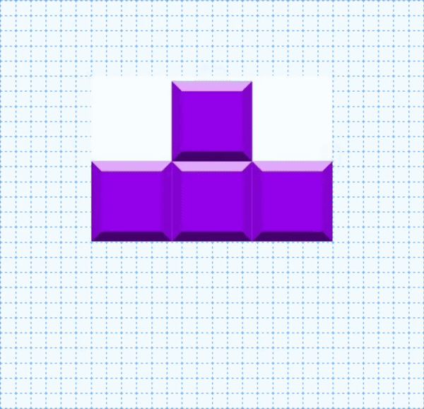

- ```shift + click``` an image to delete it<br>
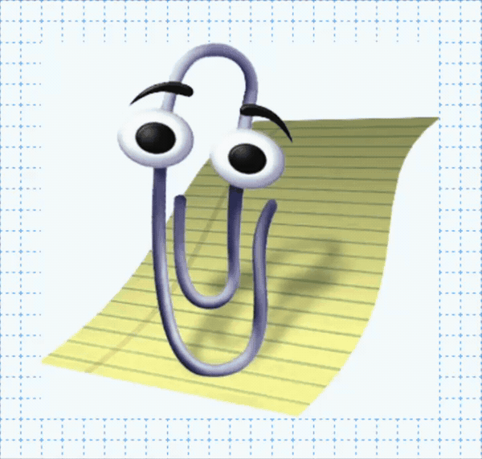

- click an empty part of the grid and drag to select multiple images at once, then move, duplicate, rotate, or delete them as a group

- press ```F2``` to select from one of seven user interface themes (you may also have to hold ```Fn```)<br>
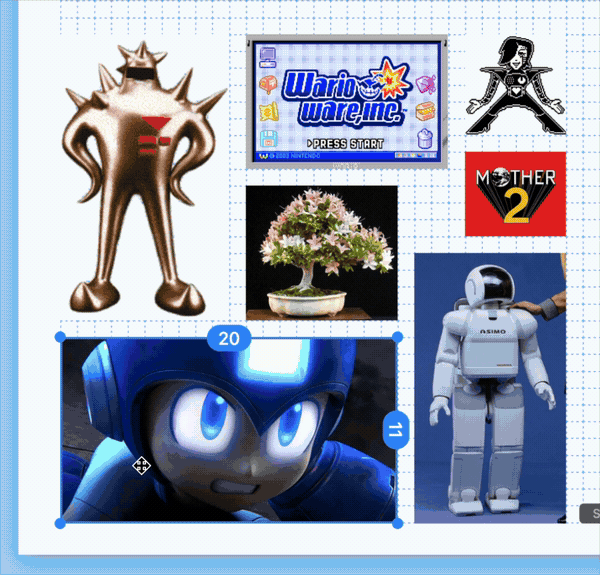

Once you've filled out the page, press ```⌘ + P``` to print using your system's default print dialog (in Safari, this will open a formatted PDF in a new tab).
<br>

>[!TIP]
>When printing...
>- select "Scale: 100%" rather than "Fit to page width"
>- set Margins to None or 0<br>
> 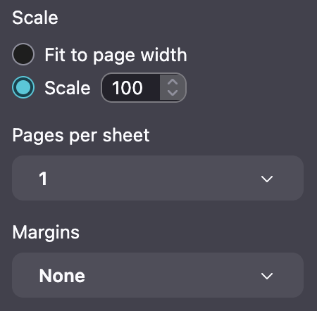

You can also press ```⌘ + E``` to export your work as a PDF, to print later or somewhere else.
<br>

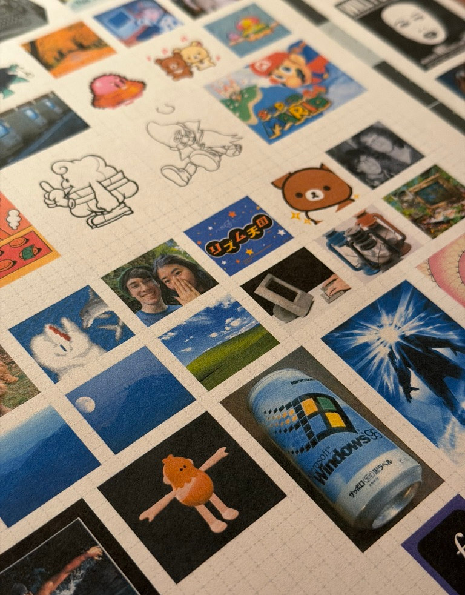

Use scissors (or a hobby knife) to cut your images to size:

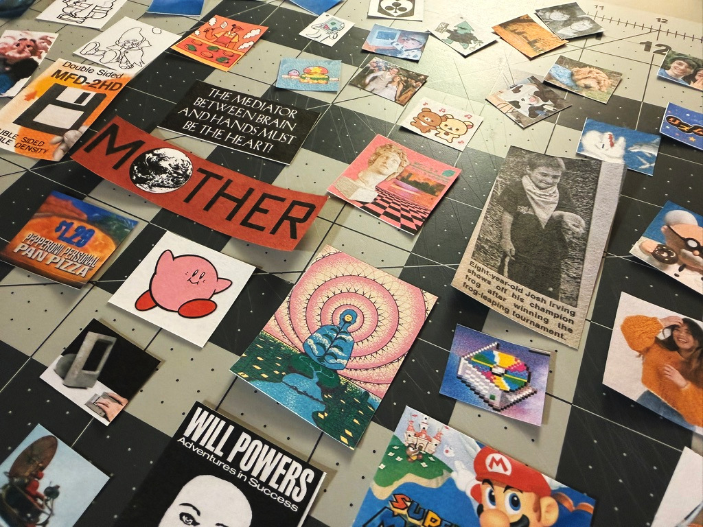

Then stick 'em down with a gluestick (or try printing with sticker paper):

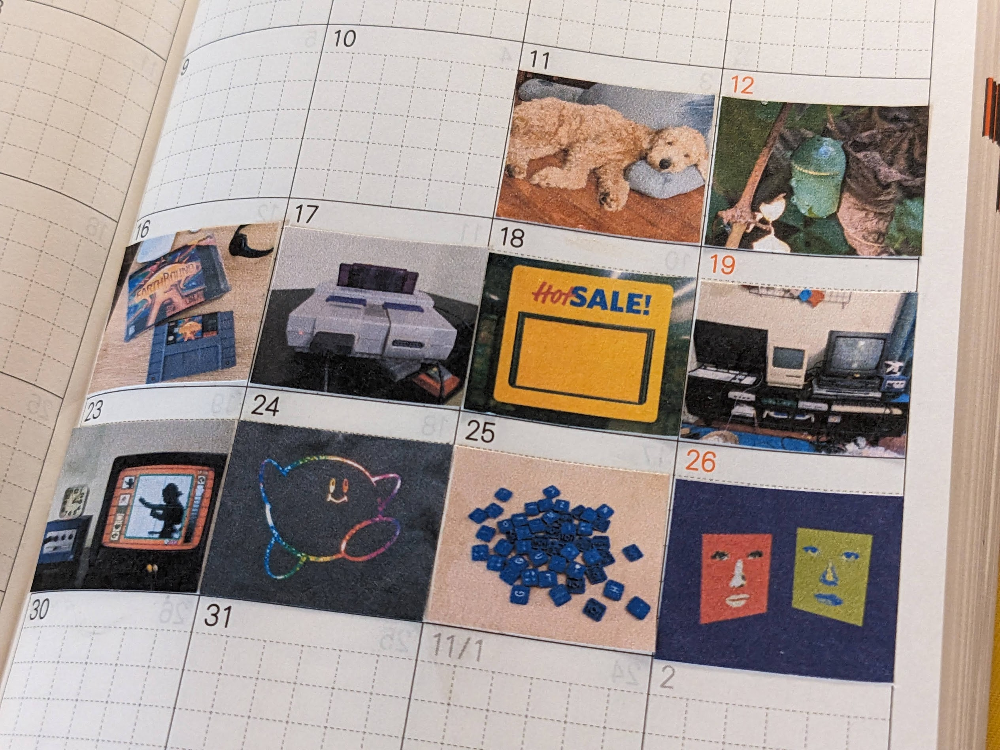

What will you remember?

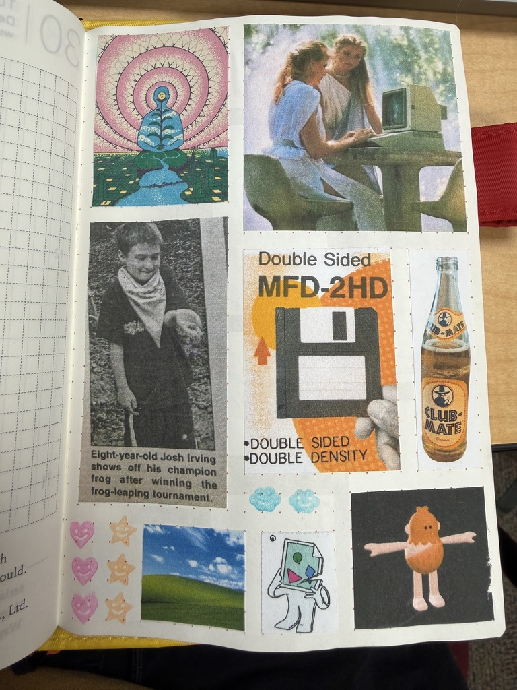

## disclaimer
This project is not affiliated with, endorsed by, or sponsored by Hobonichi Co., Ltd. or any of its subsidiaries. Hobonichi, Hobonichi Techo, and related trademarks are the property of their respective owners. This is an independent, unofficial tool created for personal use.

## license
<a href="LICENSE">GNU GPLv3</a>
